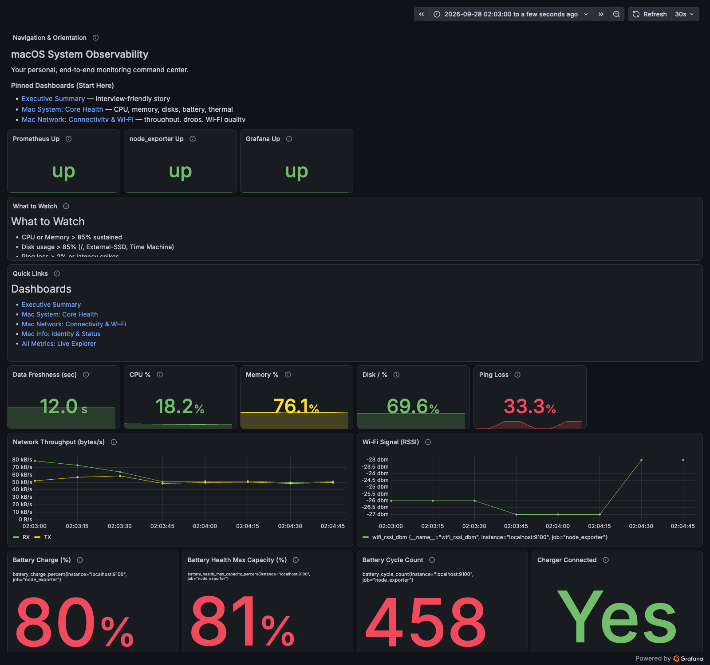
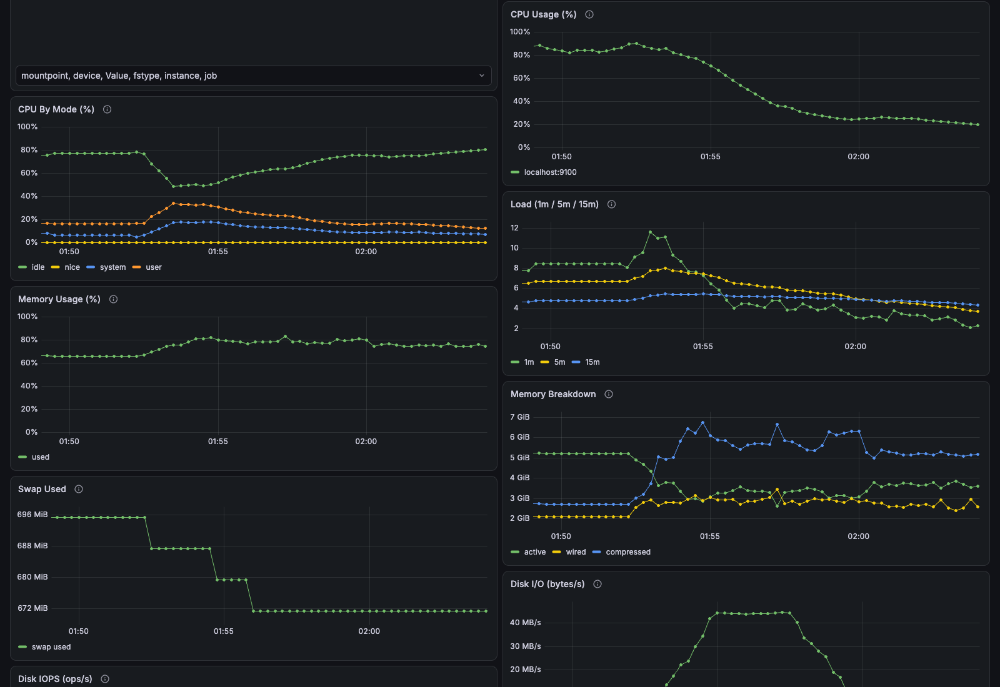
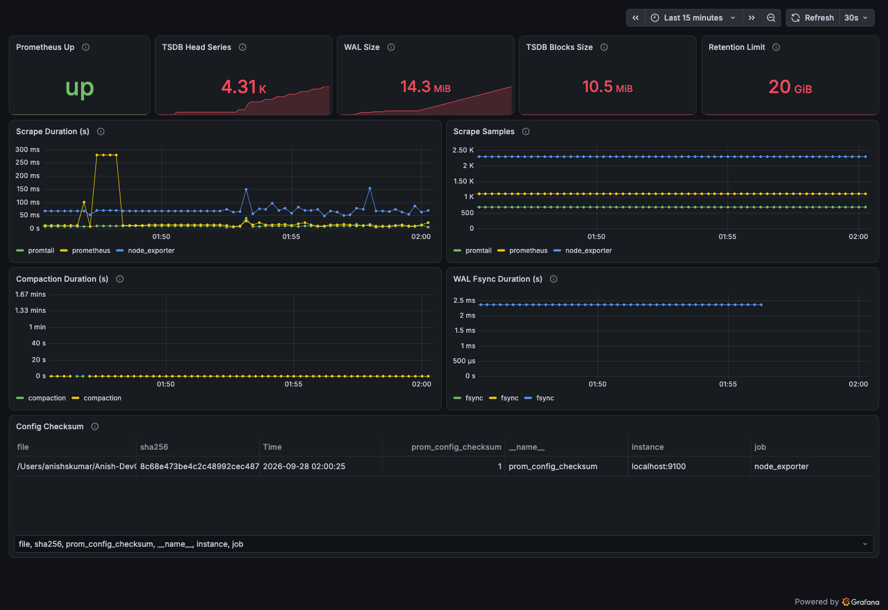
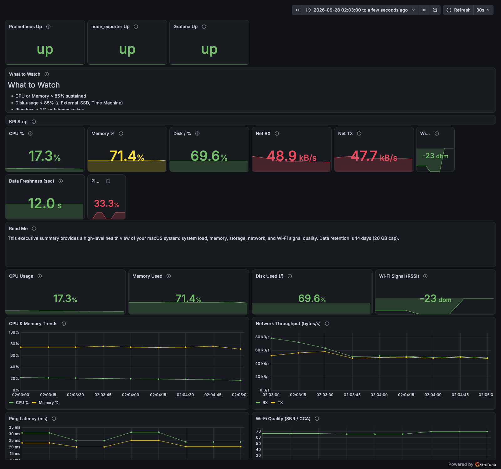

# macOS Observatory

A local monitoring stack for macOS built with Prometheus, Grafana, Loki and
Python exporters. It collects system metrics and logs, with dashboards for
host health, network activity, battery status and the monitoring services.

Maintained by **Anish S Kumar** — [ANISHSAJIKUMAR](https://github.com/ANISHSAJIKUMAR).

## Dashboards

The repository includes 11 Grafana dashboards:

| Dashboard | Purpose |
| --- | --- |
| Overview | Service health and key host metrics |
| Executive Summary | CPU, memory, storage and network trends |
| Mac System: Core Health | CPU modes, load, memory, disk I/O and battery |
| Mac Network | Interface traffic, connectivity and Wi-Fi quality |
| Mac Info | System identity and LaunchAgent status |
| Mac Logs | Search and filter collected system and application logs |
| Mac Security | Authentication, privilege and network-related log signals |
| Prometheus Self-Monitoring | Scrapes, storage and configuration checksums |
| All Metrics | Explore individual exported metrics |
| Live Capture | Packet statistics collected with tshark |
| VMware Fusion | Discovered virtual machines and host-side VM metrics |

## Screenshots

Captured from the running stack on September 28, 2026. Click an image to open
it at full resolution. Values reflect the host at capture time.

### Overview

[](docs/screenshots/overview.png)

### System health

[](docs/screenshots/mac-system-core-health.png)

### Prometheus

[](docs/screenshots/prometheus-self.png)

### Executive summary

[](docs/screenshots/executive-summary.png)

## Architecture

```text
macOS exporters ──> node_exporter ──> Prometheus ──> Grafana
System/app logs ──> Promtail ───────> Loki ────────> Grafana
```

Custom exporters write Prometheus textfiles. LaunchAgents and, where required,
LaunchDaemons schedule collection. Prometheus scrapes node_exporter and the
monitoring services; Grafana queries Prometheus and Loki.

Generated metric files stay on the host and are excluded from version control.

## Setup

You need macOS, Homebrew and Python 3. Install the monitoring services:

```bash
brew install prometheus grafana loki node_exporter promtail

git clone https://github.com/ANISHSAJIKUMAR/macOS-Observability.git
cd macOS-Observability/observability
./setup.sh
./start_all.sh
```

Review the paths and service URLs in `observability/.env` when moving the
checkout to a different directory. See [SETUP.md](SETUP.md) for configuration
and troubleshooting.

| Service | Local address |
| --- | --- |
| Grafana | `http://localhost:3000` |
| Prometheus | `http://localhost:9090` |
| Loki readiness | `http://localhost:3100/ready` |
| node_exporter | `http://localhost:9100/metrics` |

If Grafana is configured with TLS, use `https://localhost:3000` instead. Sign in
with the credentials configured for your local instance.

## Collection requirements

Available metrics depend on the host and enabled collectors:

- Packet capture requires tshark and permission to access macOS BPF devices.
- VMware panels require discoverable Fusion virtual machines.
- External-disk panels require the corresponding volumes to be mounted.
- Some Wi-Fi fields, CPU temperature and fan speed are not exposed by every
  macOS version or collector. Thermal pressure is collected separately.
- Application log counts depend on which applications have produced logs.

A missing measurement is displayed as **Unavailable**, rather than being
reported as zero. See the [dashboard verification report](docs/DASHBOARD_VERIFICATION.md)
for the checked queries, fixes and current collection limitations.

## Validation

```bash
python3 -m pytest observability/exporters/tests -q
ruff check observability/exporters
```

To check every live dashboard query, set `GRAFANA_PASSWORD` in your environment
and run:

```bash
python3 scripts/audit_dashboards.py > dashboard-audit.json
```

The audit checks datasource references, panel IDs and query responses. It
reports unavailable series separately and does not include log contents.

## Documentation

- [Setup and troubleshooting](SETUP.md)
- [Architecture](ARCHITECTURE.md)
- [Metrics catalog](METRICS_CATALOG.md)
- [Dashboard verification](docs/DASHBOARD_VERIFICATION.md)
- [Refreshing screenshots](docs/TAKE_SCREENSHOTS.md)
- [Contribution guidelines](CONTRIBUTING.md)

## Project maintenance

Issues and contributions are welcome. Include the macOS version, affected
exporter or dashboard, and the steps needed to reproduce the problem.

Built on the work of the Prometheus, Grafana, Loki, node_exporter and Homebrew
communities.
