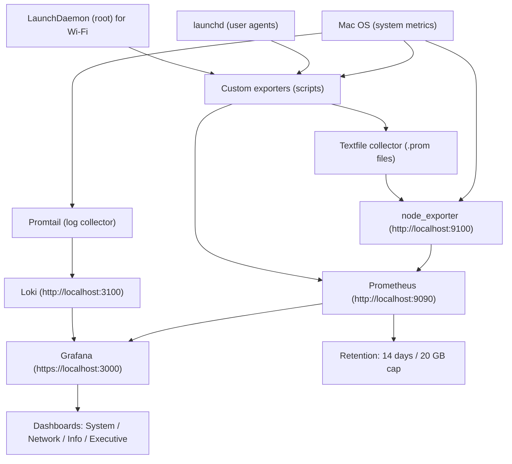

# Anish Laptop Observability (Complete Guide)

This folder is the **single source of truth** for the full local monitoring stack on this Mac.
It includes configuration, dashboards, and custom exporters.

## Tech Stack
- Prometheus (metrics storage)
- Grafana (dashboards + visualization)
- Loki (log storage)
- Promtail (log collector)
- node_exporter (system metrics)
- Custom Python exporters (network, system info, launchd, Wi‑Fi, battery, thermal, SMART, Grafana health)
- launchd / LaunchDaemon (scheduling & background services)

## UI & Performance Tuning
- Grafana uses HTTPS locally with a self‑signed certificate.
- Data proxy timeout: 30s
- Query concurrency limits set to reduce CPU usage
- Remote cache enabled (database)
- Minimum dashboard refresh interval: 10s
- Overview dashboard is the default landing page

## Quick Start
```bash
# Start/Restart all core services
brew services restart prometheus
brew services restart grafana
brew services restart node_exporter

# Reload custom exporters (user)
launchctl unload ~/Library/LaunchAgents/observability.net_connectivity.plist
launchctl unload ~/Library/LaunchAgents/observability.mac_system_info.plist
launchctl unload ~/Library/LaunchAgents/observability.launchd_metrics.plist
launchctl load ~/Library/LaunchAgents/observability.net_connectivity.plist
launchctl load ~/Library/LaunchAgents/observability.mac_system_info.plist
launchctl load ~/Library/LaunchAgents/observability.launchd_metrics.plist

# Reload Wi‑Fi exporter (root)
sudo launchctl bootout system /Library/LaunchDaemons/observability.wdutil_metrics.plist
sudo launchctl bootstrap system /Library/LaunchDaemons/observability.wdutil_metrics.plist
```

## High‑Level Architecture


## Dashboard Inventory
Grafana folder: **Anish Laptop**

- **Mac System: Core Health** — CPU, memory, disk usage (AnishSSD + Time Machine), disk I/O
- **Mac Network: Connectivity & Wi‑Fi** — throughput, errors/drops, ping health, Wi‑Fi signal/rates
- **Mac Network: Live Capture (tshark)** — live traffic analysis (top talkers, protocol mix)
- **Mac Info: Identity & Status** — system identity, key specs, running launchd jobs
- **Mac Logs: System & Apps** — system/app logs via Loki
- **Mac Security: Activity & Risk Signals** — security‑focused log signals and user activity
- **Mac Security: Activity & Risk Signals** now includes live tshark capture panels (SYN/RST/retrans/DNS/TLS)
- **All Metrics: Live Explorer** — all active Prometheus metrics (live only)
- **Executive Summary: Anish Laptop** — high‑level health view for demos/interviews
- **Anish Laptop: Overview** — navigation hub + quick KPIs
- **Prometheus: Self‑Monitoring** — scrape health, TSDB, WAL, config checksum
- **Mac System: Core Health** now includes battery health, thermal pressure, and SMART disk health panels

Dashboard exports:
```
/Users/anishskumar/Anish-DevOps-Lab/observability/grafana/dashboards/
```

## Retention Policy
Prometheus keeps **14 days** of data with a **20 GB** cap.

## Secrets and Git Safety
- No actual secrets were found in this folder (only commented examples in `grafana.ini`).
- A `.gitignore` was added at `/Users/anishskumar/Anish-DevOps-Lab/.gitignore` to prevent accidental commits of sensitive local config.
- If you ever add credentials (Grafana admin password, OAuth secrets, API tokens), keep them in local files or environment variables and **do not commit** them.

## Key Paths
```
/Users/anishskumar/Anish-DevOps-Lab/observability/prometheus/prometheus.yml
/Users/anishskumar/Anish-DevOps-Lab/observability/prometheus/prometheus.args
/Users/anishskumar/Anish-DevOps-Lab/observability/grafana/grafana.ini
/Users/anishskumar/Anish-DevOps-Lab/observability/node_exporter/node_exporter.args
/Users/anishskumar/Anish-DevOps-Lab/observability/exporters/
/Users/anishskumar/Anish-DevOps-Lab/observability/launchd/
/Users/anishskumar/Anish-DevOps-Lab/observability/loki/loki-config.yml
/Users/anishskumar/Anish-DevOps-Lab/observability/promtail/promtail-config.yml
```

## Directory Map
- `grafana/` — Grafana config + dashboard backups
- `prometheus/` — Prometheus config + rules
- `node_exporter/` — node_exporter args + textfile output
- `exporters/` — custom metric exporters (Python)
- `launchd/` — LaunchAgents/Daemons for exporters
- `loki/` — Loki config (log storage)
- `promtail/` — Promtail config (log collection)
- `migration/` — Docker + new‑Mac setup files

## Quick URLs
- Prometheus: http://localhost:9090
- Grafana: https://localhost:3000
- node_exporter: http://localhost:9100/metrics
- Loki: http://localhost:3100

## Troubleshooting
- **No data in Grafana**: check Prometheus and node_exporter are running and `http://localhost:9100/metrics` works.
- **Wi‑Fi panels empty**: ensure the root LaunchDaemon is loaded and `wdutil_metrics.py` runs with sudo.
- **Exporter metrics missing**: verify the textfile directory is correct and readable.

## Common Changes
- Change data retention in `prometheus.args`
- Add scrape targets in `prometheus.yml`
- Add or remove dashboards in Grafana and re‑export JSON
- UI improvements: KPI strip, thresholds, sparklines, “What to Watch” panels, Overview dashboard

---

See folder‑level READMEs for details.


## Showcase Flow (UI Walkthrough)
Use this order to demo the system in interviews or walkthroughs:

1. **Overview** — landing page and navigation hub
   - https://localhost:3000/d/overview/anish-laptop3a-overview
   - What it shows: overall health KPIs, quick links to all dashboards

2. **Executive Summary** — high‑level story for non‑technical audience
   - https://localhost:3000/d/exec-summary/executive-summary3a-anish-laptop
   - What it shows: top KPIs, health checks, and key risk signals

3. **System Health** — core CPU, memory, disk, battery, thermal
   - https://localhost:3000/d/mac-system-all/mac-system3a-core-health
   - What it shows: system resource health + battery and SMART status

4. **Network & Wi‑Fi** — connectivity and quality
   - https://localhost:3000/d/mac-network/mac-network3a-connectivity-and-wie28091-fi
   - What it shows: throughput, errors/drops, ping, Wi‑Fi signal/rates

5. **Live Capture (tshark)** — packet‑level live analysis
   - https://localhost:3000/d/tshark-live/mac-network3a-live-capture-tshark
   - What it shows: top talkers, protocol mix, live packet flow

6. **Logs** — system/app/observability logs
   - https://localhost:3000/d/mac-logs/mac-logs3a-system-apps-and-observability
   - What it shows: readable log streams with filters and keyword search

7. **Security** — risk signals from logs + live packet signals
   - https://localhost:3000/d/mac-security/mac-security3a-activity-and-risk-signals
   - What it shows: auth failures, privilege activity, Wi‑Fi security, tshark signals

8. **Prometheus Self‑Monitoring** — data plane health
   - https://localhost:3000/d/prometheus-self/prometheus3a-selfe28091-monitoring
   - What it shows: scrape health, TSDB usage, WAL/ingestion status

9. **All Metrics Explorer** — raw metrics for deep‑dive
   - https://localhost:3000/d/all-metrics-full/all-metrics3a-live-explorer
   - What it shows: full live metric list and raw panels


## Metrics & Logs Reference
- /Users/anishskumar/Anish-DevOps-Lab/observability/METRICS_AND_LOGS.md
