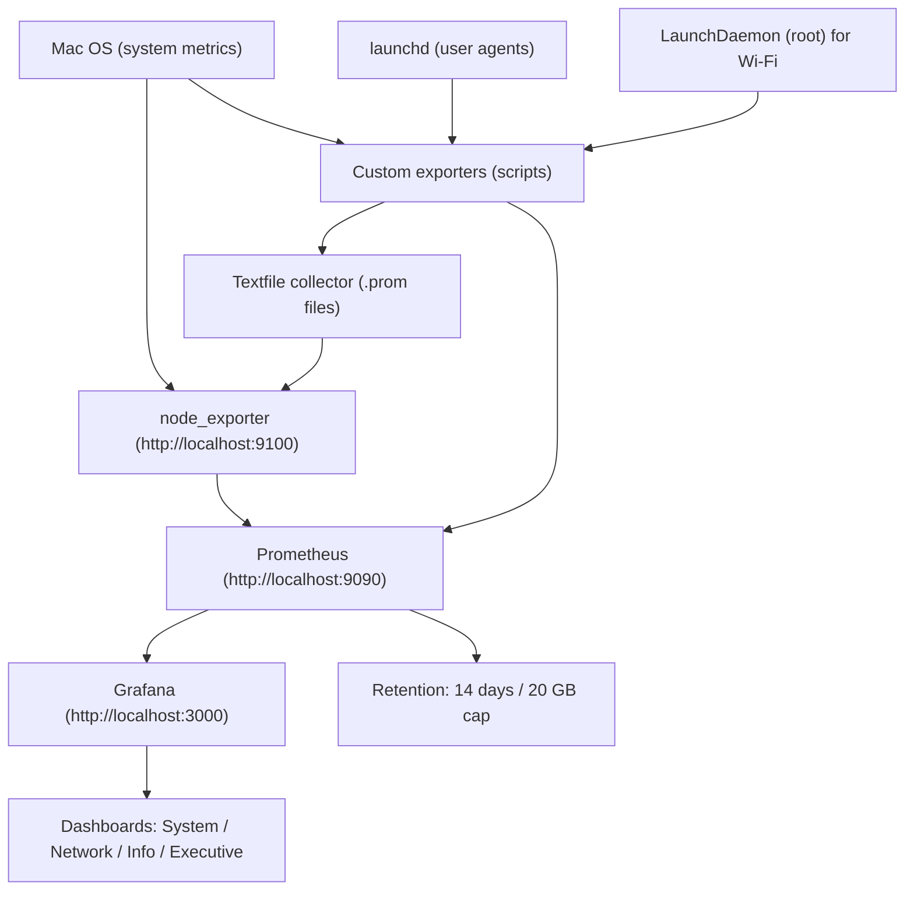

# Anish Laptop Observability (Complete Guide)

This folder is the **single source of truth** for the full local monitoring stack on this Mac.
It includes configuration, dashboards, and custom exporters.

## Tech Stack
- Prometheus (metrics storage)
- Grafana (dashboards + visualization)
- node_exporter (system metrics)
- Custom Python exporters (network, system info, launchd, Wi‑Fi)
- launchd / LaunchDaemon (scheduling & background services)

## UI & Performance Tuning
- Grafana uses HTTPS locally with a self‑signed certificate.
- Data proxy timeout: 30s
- Query concurrency limits set to reduce CPU usage
- Remote cache enabled (database)
- Minimum dashboard refresh interval: 10s
- Overview dashboard is the default landing page

## Quick Start
```bash
# Start/Restart all core services
brew services restart prometheus
brew services restart grafana
brew services restart node_exporter

# Reload custom exporters (user)
launchctl unload ~/Library/LaunchAgents/com.local.net_connectivity.plist
launchctl unload ~/Library/LaunchAgents/com.local.mac_system_info.plist
launchctl unload ~/Library/LaunchAgents/com.local.launchd_metrics.plist
launchctl load ~/Library/LaunchAgents/com.local.net_connectivity.plist
launchctl load ~/Library/LaunchAgents/com.local.mac_system_info.plist
launchctl load ~/Library/LaunchAgents/com.local.launchd_metrics.plist

# Reload Wi‑Fi exporter (root)
sudo launchctl bootout system /Library/LaunchDaemons/com.local.wdutil_metrics.plist
sudo launchctl bootstrap system /Library/LaunchDaemons/com.local.wdutil_metrics.plist
```

## High‑Level Architecture


## Dashboard Inventory
Grafana folder: **Anish Laptop**

- **Mac System: Core Health** — CPU, memory, disk usage (AnishSSD + Time Machine), disk I/O
- **Mac Network: Connectivity & Wi‑Fi** — throughput, errors/drops, ping health, Wi‑Fi signal/rates
- **Mac Info: Identity & Status** — system identity, key specs, running launchd jobs
- **All Metrics: Live Explorer** — all active Prometheus metrics (live only)
- **Executive Summary: Anish Laptop** — high‑level health view for demos/interviews
- **Anish Laptop: Overview** — navigation hub + quick KPIs

Dashboard exports:
```
/Users/anishskumar/Anish-DevOps-Lab/observability/grafana/dashboards/
```

## Retention Policy
Prometheus keeps **14 days** of data with a **20 GB** cap.

## Secrets and Git Safety
- No actual secrets were found in this folder (only commented examples in `grafana.ini`).
- A `.gitignore` was added at `/Users/anishskumar/Anish-DevOps-Lab/.gitignore` to prevent accidental commits of sensitive local config.
- If you ever add credentials (Grafana admin password, OAuth secrets, API tokens), keep them in local files or environment variables and **do not commit** them.

## Key Paths
```
/Users/anishskumar/Anish-DevOps-Lab/observability/prometheus/prometheus.yml
/Users/anishskumar/Anish-DevOps-Lab/observability/prometheus/prometheus.args
/Users/anishskumar/Anish-DevOps-Lab/observability/grafana/grafana.ini
/Users/anishskumar/Anish-DevOps-Lab/observability/node_exporter/node_exporter.args
/Users/anishskumar/Anish-DevOps-Lab/observability/exporters/
/Users/anishskumar/Anish-DevOps-Lab/observability/launchd/
```

## Quick URLs
- Prometheus: http://localhost:9090
- Grafana: https://localhost:3000
- node_exporter: http://localhost:9100/metrics

## Troubleshooting
- **No data in Grafana**: check Prometheus and node_exporter are running and `http://localhost:9100/metrics` works.
- **Wi‑Fi panels empty**: ensure the root LaunchDaemon is loaded and `wdutil_metrics.py` runs with sudo.
- **Exporter metrics missing**: verify the textfile directory is correct and readable.

## Common Changes
- Change data retention in `prometheus.args`
- Add scrape targets in `prometheus.yml`
- Add or remove dashboards in Grafana and re‑export JSON
- UI improvements: KPI strip, thresholds, sparklines, “What to Watch” panels, Overview dashboard

---

See folder‑level READMEs for details.
